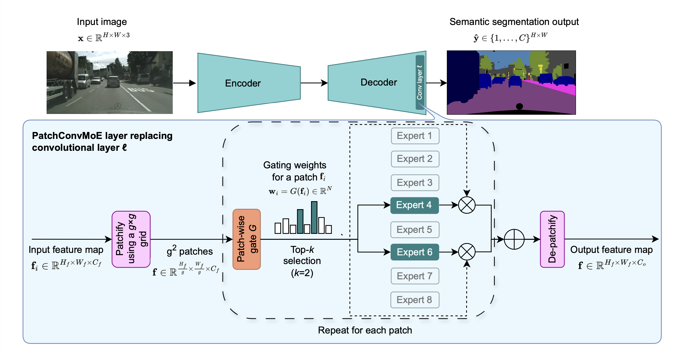

# Design and Behavior of Sparse Mixture-of-Experts Layers in CNN-based Semantic Segmentation

<div align="center">

<a href="https://pytorch.org/get-started/locally/"></a>
<a href="https://pytorchlightning.ai/"></a>
<a href="https://hydra.cc/"></a>
<a href="https://wandb.ai/"></a>

</div>

## Overview

This repository implements **PatchConvMoE** and related experiments from our CVPR 2026 workshop paper [Design and Behavior of Sparse Mixture-of-Experts Layers in CNN-based Semantic Segmentation](https://arxiv.org/abs/2604.13761). The work studies a **patch-wise** sparse mixture-of-experts (MoE) formulation for semantic segmentation: the feature map is split into a g \times g grid of patches, each patch is routed with **top-k** gating to a small subset of **convolutional experts**, and outputs are linearly combined and reassembled. We analyze gating design, routing granularity, expert count, layer placement, and balancing losses on **Cityscapes** and **BDD100K** across six CNN architectures (ENet, ERFNet, U-Net, LR-ASPP, DeepLabv3+, PSPNet), including encoder–decoder and backbone-based models.

This codebase builds on our earlier works on sparse MoE layers in CNNs: [Sparsely-gated Mixture-of-Expert Layers for CNN Interpretability](https://arxiv.org/abs/2204.10598) and [Robust Experts: the Effect of Adversarial Training on CNNs with Sparse Mixture-of-Experts Layers](https://arxiv.org/abs/2509.05086).

**PatchConvMoE**:
<div align="center">

</div>


## Project Structure

```
├── bash/                           # Batch training scripts (Cityscapes, BDD100K, ADE20K, Pascal, etc.)
├── configs/                        # Hydra configuration
│   ├── experiment/                 # Per-dataset / per-model experiment presets
│   │   ├── cityscapes-enet/
│   │   ├── cityscapes-deeplabv3/
│   │   ├── bdd100k-lraspp/
│   │   └── ...
│   ├── model/                      # Model, optimizer, scheduler, metrics
│   │   └── nn/                     # Architecture-specific and MoE options
│   ├── datamodule/                 # Datasets and transforms
│   ├── callbacks/
│   ├── logger/
│   └── config.yaml                 # Main config entry
├── src/
│   ├── models/                     # Lightning modules and backbones
│   │   └── nn/
│   │       ├── moe/                # MoE core (layer, routing, gates)
│   │       ├── enet/               # ENet + patch / conv MoE variants
│   │       ├── erfnet/
│   │       ├── unet/
│   │       ├── lraspp/
│   │       ├── deeplabv3plus/
│   │       ├── pspnet/
│   │       ├── segnet/
│   │       └── resnet.py
│   ├── datamodules/
│   ├── evaluation/                 # Prediction and visualization utilities
│   ├── callbacks/
│   ├── metrics/
│   └── utils/
├── scripts/                        # Analysis and benchmarking
│   ├── benchmark_inference_time.py
│   ├── compute_gflops.py
│   ├── query_routing_collapse_entropy.py
│   └── visualize_*.py
├── tests/
├── run.py                          # Training entry (Hydra)
├── eval.py                         # Standard evaluation (Hydra, evaluate.yaml)
├── eval_fixed_moe.py               # Fixed-expert analysis
└── requirements.txt
```

## Quick Start

### Environment Setup

1. **Clone the repository**

```bash
git clone <repository-url>
cd sparse-moes-for-semseg
```

1. **Create and activate a conda environment**

```bash
conda create -n moe-seg python=3.9
conda activate moe-seg
```

1. **Install dependencies**

```bash
pip install -r requirements.txt
```

### Basic Training

1. **Cityscapes ENet (baseline-style config)**

```bash
python run.py experiment=cityscapes-enet/default
```

1. **Cityscapes ENet with PatchConvMoE**

```bash
python run.py experiment=cityscapes-enet/patch_conv_moe
```

1. **Another architecture (example: BDD100K LR-ASPP)**

```bash
python run.py experiment=bdd100k-lraspp/patch_conv_moe
```

### Advanced Configuration

Override MoE and routing hyperparameters from the command line, for example:

```bash
python run.py experiment=cityscapes-enet/patch_conv_moe \
  model.model.patch_size= [128,128] \
  model.model.num_experts=8 \
  model.model.k=2 \
  model/nn/routing@model.model.routing_layer_type=double_conv_global_pooling \
  model.model.balancing_loss_type="entropy" 
```

Exact config keys depend on the chosen model YAML; inspect `configs/model/nn/` and the selected experiment for available fields.

## Evaluation and Analysis

### Standard Evaluation

```bash
python eval.py experiment=<your-eval-experiment> \
  wandb.run_name=your_run_name
```

### Fixed Expert Analysis

```bash
python eval_fixed_moe.py experiment=<your-fixed-moe-eval> \
  wandb.run_name=your_run_name
```

### Routing Collapse and Efficiency

- **Inference time:** `python scripts/benchmark_inference_time.py` (see script for CLI options).
- **GFLOPs:** `python scripts/compute_gflops.py`.
- **Routing statistics (e.g. entropy / collapse):** `python scripts/query_routing_collapse_entropy.py`.

### Batch Jobs

Use the shell scripts under `bash/` for scheduled or cluster runs, for example:

```bash
bash bash/cityscapes_enet.sh
```

## Configuration Details

### MoE and Patch Routing (typical knobs)

- `num_experts`: Number of convolutional experts N.
- `k`: Top-k experts activated per patch.
- Balancing loss type and weight: encourage uniform expert usage (entropy, importance, switch).
- Patch grid / patch size: trades spatial adaptivity vs. compute; tied to feature map resolution before the MoE layer.
- **Gate:** Conv-GAP vs. deeper 2Conv-GAP (and variants).

### Training Notes

The paper uses SGD-style training with fixed hyperparameters per setup; reproduce details from the corresponding experiment YAML and the manuscript (crop sizes, epochs, datasets).

## Experiment Examples

```bash
# Cityscapes DeepLabv3+ with patch MoE-style configuration
python run.py experiment=cityscapes-deeplabv3/patch_conv_moe

# Cityscapes PSPNet
python run.py experiment=cityscapes-pspnet/patch_conv_moe

# BDD100K U-Net
python run.py experiment=bdd100k-unet/patch_conv_moe
```

## Citation

If you find this code useful for your research, please cite our papers:
```bibtex
@inproceedings{pavlitska2026design,
  author    = {Svetlana Pavlitska and
               Haixi Fan and
               Konstantin Ditschuneit and
               J. Marius Z{\"o}llner},
  title     = {Design and Behavior of Sparse Mixture-of-Experts Layers in CNN-based Semantic Segmentation},
  booktitle = {Computer Vision and Pattern Recognition Conference (CVPR) - Workshops},
  year      = {2026},
}
```


Related earlier work:
```bibtex
@inproceedings{pavlitska2023sparsely,
  author    = {Svetlana Pavlitska and
               Christian Hubschneider and
               Lukas Struppek and
               J. Marius Z{\"o}llner},
  title     = {Sparsely-gated Mixture-of-Expert Layers for {CNN} Interpretability},
  booktitle = {International Joint Conference on Neural Networks (IJCNN)},
  year      = {2023},
}
```

```bibtex
@inproceedings{pavlitska2025robust,
  title     = {Robust Experts: the Effect of Adversarial Training on {CNNs} with Sparse Mixture-of-Experts Layers},
  author    = {Svetlana Pavlitska and
               Haixi Fan and
               Konstantin Ditschuneit and
               J. Marius Z{\"o}llner},
  booktitle = {International Conference on Computer Vision (ICCV) - Workshops},
  year      = {2025}
}
```

